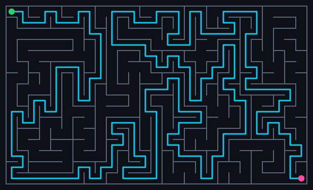

# amaze

A tiny, dependency-free maze **generator** and **solver** for your terminal.
Pure Python standard library, with a real test suite.



*A 27×16 maze with the A\* solution overlaid (green = start, pink = goal). The
SVG is produced by the tool itself — `python -m amaze.cli -W 27 -H 16 --seed 7
--solver astar --svg > maze.svg`. A braided variant with loops lives at
[`examples/maze-braided.svg`](examples/maze-braided.svg).*

```
amaze/
  maze.py        # grid model, generation algorithms, pathfinding solvers
  render.py      # Unicode box-drawing renderer with a colored solution overlay
  cli.py         # argparse command-line interface
  test_maze.py   # pytest suite (structural + correctness guarantees)
```

## Run it

```bash
python -m amaze.cli --width 30 --height 15
python -m amaze.cli -W 40 -H 20 --algo prim --solver astar --seed 7
python -m amaze.cli -W 30 -H 15 --braid 1.0      # loops + shortcuts, no dead ends
python -m amaze.cli --no-solve --no-color        # just the maze, plain text
```

| Flag | Default | Meaning |
| --- | --- | --- |
| `-W/--width`, `-H/--height` | 25 × 12 | maze size in cells |
| `--algo` | `backtracker` | `backtracker` (winding) or `prim` (bushy) |
| `--solver` | `bfs` | `bfs` or `astar` — both find the optimal path |
| `--seed` | random | fix for reproducible mazes |
| `--braid` | `0.0` | remove this fraction (0–1) of dead ends, adding loops |
| `--no-solve` | off | skip the solution overlay |
| `--no-color` | off | disable ANSI colors |

Every run prints a stats line — dead-end count, size, whether it's braided,
and the solution length — so you can see how the knobs change the maze.

## Braiding

A freshly generated maze is *perfect*: exactly one path between any two cells.
`--braid` carves extra passages out of dead ends to create **loops**, so there
are multiple routes to the goal and the solver gets to pick the genuinely
shortest one. `--braid 1.0` removes every dead end; partial values (e.g. `0.4`)
leave some. It only ever adds passages, so the maze always stays fully
connected. (The one exception: a 1×N corridor's two endpoints have no wall to
carve through, so full braiding leaves exactly those two dead ends.)

## Custom start and goal

By default the solution runs from the top-left cell to the bottom-right. Pass
`--start X,Y` and/or `--goal X,Y` (0-indexed) to solve between any two cells:

```bash
python -m amaze.cli -W 20 -H 12 --start 0,0 --goal 19,0 --braid 0.3
```

## Use it as a library

```python
from amaze import generate_backtracker, solve_astar, render

maze = generate_backtracker(20, 10, seed=42)
path = solve_astar(maze)
print(render(maze, path))
```

## Test it

```bash
python -m pytest amaze/ -q
```

The suite checks that generated mazes are **perfect** — proven by asserting
both connectivity (every cell reachable) *and* the tree property (edges ==
cells − 1, i.e. no loops). It also verifies passage symmetry, seed
reproducibility, custom start/goal solving, braid connectivity/dead-end
removal (including the corridor edge case), and that BFS and A* agree on the
optimal path length.
