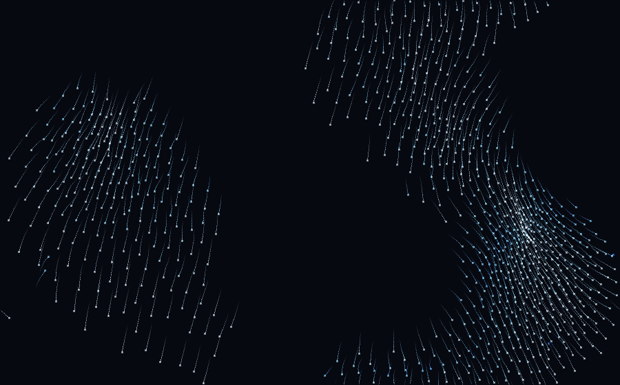

# Boids — Flocking Studio

An interactive **flocking simulation**, after Craig Reynolds' 1986 *Boids*. Every
bird-oid steers by just three rules, looking only at its neighbours:

- **separation** — turn away from anyone crowding you,
- **alignment** — fall in with your neighbours' average heading,
- **cohesion** — drift toward the middle of your local group.

No boid has any idea there's a flock. The swirling, splitting, re-merging murmur­
ation on screen is entirely **emergent** — it falls out of those three local
rules and nothing else. Tug the sliders and you can tip the same flock from a
tight school into a loose scatter into rolling lanes.

**Zero dependencies, zero build step.** Just open `index.html` in a browser.



*A still from the simulation — distinct flocks moving in aligned lanes, with a
vortex forming at right. This exact image was produced by a pure-Python port of
the same three rules and spatial-hash neighbour search; see
[`tools/gen_boids.py`](../tools/gen_boids.py).*

```
boids/
  index.html    # UI shell
  style.css     # glassy control panel
  main.js       # UI wiring + render loop
  boids.js      # the flocking engine (spatial-hash neighbour search)
  palettes.js   # six speed-gradient colour schemes
```

## Controls

| Control | What it does |
| --- | --- |
| Boids | how many agents are in the flock |
| Perception | how far each boid looks for neighbours |
| Personal Space | radius inside which it actively pushes away |
| Separation / Alignment / Cohesion | the relative pull of each of the three rules |
| Max Speed | top speed (boids are also kept from stalling) |
| Trail Length | how long the motion trails linger |
| Boid Size | triangle scale |

**Mouse:** hold left-click to gather the flock toward the cursor, right-click to
scatter it. **Keys:** `Space` pause · `V` toggle vision circles · `R` reseed ·
`S` save PNG · `H` hide panel.

Turn on **Vision** to see each boid's perception radius, hit **Surprise** to
randomize into a new flock, or **Save PNG** to keep a frame.

## How it scales

The naïve way to find a boid's neighbours is to check every other boid — O(n²),
which crawls once you pass a few hundred. Instead the engine drops every boid
into a **uniform spatial-hash grid** sized to the perception radius each frame,
so a boid only ever compares itself against the handful of others in its own cell
and the eight around it. That keeps the whole thing near O(n) and smooth with a
couple of thousand boids.
