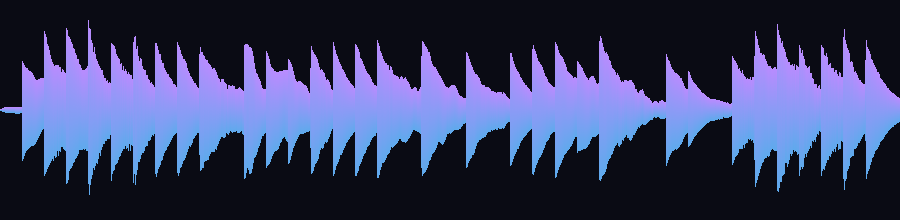

# Driftwave

A generative ambient music engine that runs entirely in the browser — no
samples, no libraries, no build step. Every session is improvised on the fly,
so it's never the same twice. Just open `index.html` and press **Play**.



*🎧 **Listen:** [`examples/driftwave-sample.wav`](examples/driftwave-sample.wav)
(16s). Both the clip and the waveform above were synthesized by a pure-Python
port of the engine's voices — see
[`tools/gen_driftwave.py`](../tools/gen_driftwave.py). You can see the
rhythmic plucks fire and decay over the sustained pad swells.*

```
driftwave/
  index.html   # UI shell
  style.css    # glassy control panel + transport
  synth.js     # the audio engine (Web Audio API)
  main.js      # UI wiring + canvas visualizer
```

## How it sounds

Two voices weave together over a shared synthesized reverb:

- **Pads** — three slightly detuned sawtooth oscillators per note, swept
  through a lowpass filter, swelling and fading over four beats.
- **Melody** — sparse triangle-wave plucks drawn probabilistically from the
  chosen scale, biased toward gentle stepwise motion.

## Controls

| Control | Effect |
| --- | --- |
| Scale | Major/Minor Pentatonic, Dorian, Lydian, Hirajoshi, Whole-Tone |
| Root | transpose the whole piece |
| Tempo | 48–120 bpm |
| Density | how often melody notes fire |
| Reverb | dry ↔ cathedral |
| Volume | master level |

## Under the hood

Scheduling uses the standard Web Audio "two clocks" pattern: a 25 ms
look-ahead loop queues note events ~100 ms into the future against the
sample-accurate `AudioContext` clock, so timing stays tight even when the main
thread is busy. The reverb is a `ConvolverNode` fed a procedurally generated
decaying-noise impulse response. Plucks are scattered across the stereo field
with a `StereoPannerNode` for width, and the whole mix runs through a
`DynamicsCompressorNode` acting as a limiter so stacked pads, plucks and reverb
tails never clip into distortion. The visualizer reads an `AnalyserNode` for a
live waveform over a faint spectrum.

> Audio can only start from a user gesture, so nothing plays until you click
> **Play** — that's a browser rule, not a bug.
